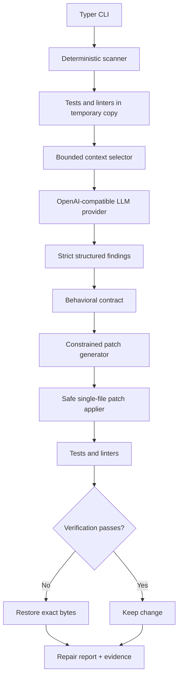

# Repo Doctor

[](https://github.com/asxvgxkep/repo-doctor/actions/workflows/ci.yml)
[](https://www.python.org/downloads/)


**Repository diagnostics, optional LLM semantic analysis, and safely verified repair from one
local-first CLI.**

Deterministic scanning stays local and offline unless `--ai` is explicitly enabled; without that
flag, Repo Doctor never initializes an AI provider or contacts an external service.

## Quick Demo

```console
repo-doctor scan .
repo-doctor scan . --ai
repo-doctor fix . --ai --dry-run
repo-doctor fix . --ai
```

The first command runs deterministic checks only; the others explicitly opt into semantic analysis
or repair. For an AI fix, Repo Doctor selects at most one high-confidence issue, generates a
constrained patch, and reruns verification. It keeps the change only when verification succeeds;
otherwise it restores the exact original bytes.

## Tool execution backends

Local execution remains the default and requires no ToolHub process:

```console
repo-doctor scan . --tool-backend local
```

An MCP backend is available for scans and AI repair when a production MCP ToolHub checkout is
explicitly configured with an absolute path:

```powershell
$env:REPO_DOCTOR_TOOLHUB_PROJECT = "D:\mcp-toolhub"
```

```sh
export REPO_DOCTOR_TOOLHUB_PROJECT=/opt/mcp-toolhub
```

The configured path must resolve to an existing directory. On Windows only, `D:\mcp-toolhub` is
used as a compatibility default when that directory actually exists. POSIX systems and Windows
systems without that directory fail closed with a configuration error.

```console
repo-doctor scan D:\target-repository --tool-backend mcp
repo-doctor fix D:\target-repository --ai --tool-backend mcp
```

Repo Doctor launches ToolHub's production stdio entry point, never the development `mcp run`
bootstrap. The exact checkout-bound launch is:

```text
Windows: <toolhub>\.venv\Scripts\python.exe -m mcp_toolhub serve
POSIX:   <toolhub>/.venv/bin/python -m mcp_toolhub serve
```

If that project-local interpreter is absent, startup fails. Repo Doctor never searches `PATH`,
never executes a global `mcp-toolhub`, and never uses Repo Doctor's own Python interpreter to import
`mcp_toolhub`. The subprocess has the canonical checkout as its fixed working directory and
`TOOLHUB_WORKSPACE_ROOT` set to the canonical target repository. Its environment removes
`PYTHONPATH`, `PYTHONHOME`, and other Python startup/module-redirection variables while preserving
an explicitly supplied `TOOLHUB_STATE_ROOT`. Transport is stdio only and ToolHub keeps stdout
protocol-only.

Immediately after MCP initialization, Repo Doctor calls `toolhub.capabilities` and parses only its
`structuredContent`. This adapter requires Contract major version 1, transport `stdio`, the
human-only/out-of-band/atomic/single-use/expiring approval model, and these exact mappings:

```text
shell.run                 -> shell.run_approved
filesystem.apply_patch    -> filesystem.apply_patch_approved
```

Compatible Contract `1.x` minor versions are accepted when all required fields and mappings remain
valid. ToolHub's package version is independent of its contract version and is not compared with
Repo Doctor's package version. Missing or malformed capabilities, another contract major, or an
unsafe resume mapping fails backend startup; there is no legacy downgrade.

Repository-defined commands and mutations can return `APPROVAL_REQUIRED`. Repo Doctor persists the
server's request ID, expiry, declared resume tool, latest structured outcome/status, and lifecycle
trace ID. It never parses human-readable messages or JSON text to decide what happens next.
Approval is always an out-of-band human action. Use the trusted configured checkout's admin
executable for the decision:

```powershell
& "$env:REPO_DOCTOR_TOOLHUB_PROJECT\.venv\Scripts\mcp-toolhub-admin.exe" list
& "$env:REPO_DOCTOR_TOOLHUB_PROJECT\.venv\Scripts\mcp-toolhub-admin.exe" approve REQUEST_ID
& "$env:REPO_DOCTOR_TOOLHUB_PROJECT\.venv\Scripts\mcp-toolhub-admin.exe" reject REQUEST_ID
```

On POSIX, use `$REPO_DOCTOR_TOOLHUB_PROJECT/.venv/bin/mcp-toolhub-admin` with the same subcommands.
**Repo Doctor never approves or rejects its own requests and provides no approval command.**

When approvals are pending, Repo Doctor atomically stores a versioned orchestration session under
its user-level state directory and prints its session ID; the target repository is never modified
by session creation. The default location is `%LOCALAPPDATA%\repo-doctor\sessions` on Windows and
`~/.local/state/repo-doctor/sessions` elsewhere. Set `REPO_DOCTOR_STATE_ROOT` to an absolute
directory to override the state root. After an operator approves any subset of the requests
out-of-band, resume from anywhere:

```console
repo-doctor resume <session-id>
```

Resume binds ToolHub to the canonical target path saved in the session. For every unresolved
request it first calls `toolhub.request_status`. Only an explicit structured
`APPROVAL_APPROVED` result may proceed. Repo Doctor then verifies that the fresh server-declared
`resume_tool` matches both the negotiated mapping and the operation kind, and invokes it with the
request ID only. `APPROVAL_PENDING` remains resumable; rejected and expired requests become terminal;
unknown or unavailable requests are never recreated; and a consumed request that is not already
locally completed is surfaced as a non-execution/reconciliation error rather than guessed as
success. One approved verification can progress while other requests remain pending, and every
completed operation is atomically saved before the next.

The ToolHub trace ID returned at submission is retained across status and approved execution. A
different trace for the same request is a contract-correlation failure; Repo Doctor never replaces
the stored trace and never substitutes its own session ID. Session schema v2 stores bounded report
context and approval-handle metadata, but no patch body, protected ToolHub snapshot, local
`approved=true` flag, or self-approval mechanism. Schema-v1 pending requests can be read for display
but are migrated to non-resumable state because old files cannot confer Contract V1 authority.

For an MCP AI repair, Repo Doctor diagnoses the issue, rereads the selected target through
`filesystem.read_file`, validates the proposal against those exact bytes, and submits a unified
patch through `filesystem.apply_patch`. Every existing-file repair includes ToolHub's returned
SHA-256 as `expected_hash`; a stale hash is a terminal `PATCH_CONFLICT` and never triggers a forced
write or automatic resubmission. Conflict behavior is driven by structured `CONFLICT` outcome/error
metadata, never by matching message text.

The complete lifecycle is:

```text
Repo Doctor -> production ToolHub stdio -> toolhub.capabilities
            -> submit operation -> APPROVAL_REQUIRED -> persist handle
human admin -> approve/reject out of band
Repo Doctor -> resume -> toolhub.request_status -> APPROVAL_APPROVED
            -> validated server resume_tool(request_id) -> correlated final outcome
```

For shell execution, `SUCCEEDED`, `COMMAND_FAILED`, `TIMED_OUT`, `REFUSED`, and `FAILED` are mapped
directly from the structured outcome. For patches, `SUCCEEDED`, `CONFLICT`, approval terminal states,
`REFUSED`, and `FAILED` are likewise structured mappings. Once ToolHub applies and consumes an
immutable patch request, Repo Doctor submits discovered verification commands through `shell.run`.
Completed verification is followed by ToolHub `git.diff`, whose bounded summary remains available
for operator review and trace correlation.

The MCP repair workflow deliberately does not perform a hidden local rollback. If ToolHub has applied the
approved patch and verification later fails, the session ends in `VERIFICATION_FAILED` and leaves
the change visible in ToolHub's Git diff. A correction or revert therefore remains an explicit,
reviewable follow-up. Local repair remains the default and preserves its existing exact-byte
rollback behavior.

## AI Repair in Action

A real end-to-end repair: Repo Doctor analyzes repository evidence, builds a behavioral contract, generates a constrained AI patch, reruns verification, and keeps the change only after checks pass. Failed repairs are rolled back with structured evidence reports.


## Why Repo Doctor?

- **Deterministic health checks** discover the stack and run supported tests and linters in an
  isolated repository copy.
- **Opt-in LLM analysis** adds semantic review only when `--ai` is present.
- **Structured, confidence-gated findings** turn provider output into validated, explainable data.
- **Secret-aware bounded context** limits which files and how much source can leave the machine.
- **Constrained patch generation** permits one bounded text replacement, never provider-supplied
  shell commands.
- **Verification and automatic rollback** keep a repair only if every discovered check passes and
  the deterministic score does not regress.

## Verified in v0.3.0

- Automated test suite: **227 passed, 5 skipped**.
- Repo Doctor self-scan: **100/100**.
- Real DeepSeek API semantic analysis and AI dry-run tested.
- Real AI fix, verification, and keep workflow tested end to end.

## Requirements and installation

Python 3.12 or newer is required. On Windows PowerShell:

```powershell
py -3.12 -m venv .venv
.\.venv\Scripts\Activate.ps1
python -m pip install -e ".[dev]"
repo-doctor --help
```

On Linux or macOS, activate with `source .venv/bin/activate` instead.

## Deterministic and AI modes

Deterministic mode detects conventional Python and Node.js projects and discovers `pytest`,
`ruff check .`, `npm test`, and `npm run lint`. Commands are argument vectors executed without a
shell against a temporary repository copy.

```powershell
# Local deterministic report; no provider is contacted
repo-doctor scan .

# Save the local report
repo-doctor scan . --output health.md

# Conservative trailing-whitespace repair for parseable Python source
repo-doctor fix .
```

AI mode is opt-in:

```powershell
repo-doctor scan . --ai
repo-doctor scan . --ai --output health.md
repo-doctor fix . --ai --dry-run
repo-doctor fix . --ai
```

`fix --ai` requires a Git repository, a clean worktree, and at least one discovered test or lint
command. It considers at most one finding whose confidence is at least 0.85. Dry run performs
analysis and displays a unified preview without modifying the target.

## Provider configuration

Repo Doctor uses an OpenAI-compatible chat-completions HTTP interface and is not coupled to a
specific vendor. Set the three required variables for AI mode. The request timeout is optional and
defaults to 180 seconds, which accommodates semantic analysis of repository context:

```powershell
$env:REPO_DOCTOR_API_KEY = "your-provider-key"
$env:REPO_DOCTOR_BASE_URL = "https://provider.example/v1"
$env:REPO_DOCTOR_MODEL = "provider-model-name"
$env:REPO_DOCTOR_REQUEST_TIMEOUT = "180"
repo-doctor scan . --ai
```

The base URL may be a versioned API root or the complete `/chat/completions` endpoint. Repo Doctor
does not load `.env` files automatically; `.env.example` is documentation only. The timeout accepts
positive finite seconds, including decimal values. Missing or invalid configuration produces an
actionable report message. Keys and authorization headers are never included in prompts, logs,
reports, or object representations.

## Architecture



The deterministic pipeline is always run first:

1. `detector.py` recognizes manifests and supported verification commands.
2. `scanner.py` inventories text and runs checks in a temporary copy.
3. `analyzer.py` applies explicit deterministic rules and establishes the base score.
4. `report.py` renders command evidence, findings, and scoring details.

The optional AI pipeline lives under `repo_doctor/ai/`:

- `selector.py` ranks failed-output references, stack source, configuration, small core modules,
  and README context within hard file, byte, and total-character limits.
- `provider.py` defines the vendor-neutral protocol; `openai_compatible.py` implements HTTP calls.
- `parser.py` accepts exact JSON schemas and rejects missing fields, extra fields, unsafe paths,
  invalid severity, and out-of-range confidence.
- `workflow.py` ensures findings reference only files actually sent to the provider.
- `patching.py` validates and atomically applies one unique text replacement.
- `fixer.py` selects one issue, verifies it, and keeps or rolls back the change.

## AI semantic report and scoring

A validated finding records an ID, title, category, controlled severity, confidence, relative
file, line range, explanation, evidence, and suggested fix. Arbitrary provider prose never becomes
program state. A report entry resembles:

```markdown
## AI Semantic Analysis

### Finding 1: Exact stock cannot be fulfilled

- Severity: High
- Confidence: 0.93
- File: `inventory.py`
- Lines: 6

Problem:
The equality boundary is rejected.
```

The deterministic score remains visible. Only validated findings at confidence 0.85 or higher
change the final score: critical costs 20 points, high 12, medium 5, and low 0. The final score is
clamped to 0–100, so identical validated input always produces the same score.

## Context selection and data boundaries

Repo Doctor never sends the entire repository blindly. Defaults are 20 files, 100,000 bytes per
file, and 200,000 total characters. Repositories larger than this are ranked and truncated rather
than rejected. It excludes Git/tool caches, virtual environments, dependencies, build output,
coverage artifacts, generated/minified files, binaries, large lockfiles, and likely secrets such
as `.env*`, `*.pem`, `*.key`, `credentials*`, and `secrets*`. Symlinks are not selected.

Source and command evidence sent to the configured endpoint can still be sensitive. Review the
provider's data policy and use `--ai` only for repositories you are authorized to disclose.

## AI fix, verification, and rollback

The model cannot return shell commands or arbitrary diffs. The accepted patch has exactly five
fields: `file`, `old_text`, `new_text`, `reason`, and `confidence`. Before applying it, Repo Doctor
requires that:

- the relative path is traversal-free, inside the repository, non-secret, and non-ignored;
- the target is a regular, non-symlink UTF-8 text file;
- the file hash still matches the context analyzed by the model;
- `old_text` occurs exactly once;
- confidence is at least 0.85 and replacement size limits are respected.

In default local mode, Repo Doctor captures the target's exact bytes, applies the replacement
atomically, and reruns the same discovered verification commands in an isolated copy. It keeps the
edit only when every command passes and the deterministic score does not regress. Failure or a
verification exception restores the exact captured bytes. A rollback failure is reported
explicitly and requires manual Git restoration. In MCP mode, ToolHub owns mutation and in-place
verification as described above; verification failure is reported without an automatic rollback.

## Security model

- No AI provider is initialized unless `--ai` is present.
- API keys remain in request headers and are never printed or placed in prompts; credential-like
  environment variables are removed from verification subprocesses.
- Provider JSON is treated as untrusted and validated twice, including custom providers/fakes.
- Paths are normalized and checked against traversal, symlinks, secret patterns, and repository
  boundaries.
- No provider-supplied command is ever executed; application subprocesses use `shell=False`.
- Symlinks are excluded from text-file fixes and isolated verification copies, preventing external
  targets and broken links from being followed.
- AI fix requires a clean Git worktree and changes at most one regular text file.
- Exact-byte snapshots support automatic rollback of the only modified file.

Scanning still executes repository-defined test and lint commands in a temporary copy. Those
commands are local third-party code and should be treated with the same care as running the
project's test suite directly.

## Supported platforms

Repo Doctor supports Windows, Linux, and macOS. Application logic and tests use `pathlib`,
`shutil`, `tempfile`, and argument-vector `subprocess` calls. No Unix-only utilities or
`shell=True` commands are required.

## Limitations

- Detection currently covers conventional Python and npm layouts, not arbitrary monorepos.
- Dependencies are not installed automatically; missing executables appear as failed checks.
- Node dependency directories are omitted from the temporary copy, so tools must be available to
  the discovered command through the environment.
- OpenAI-compatible endpoints differ; a provider must support chat completions and JSON-object
  response formatting.
- Context selection is deterministic keyword/path ranking, not a full dependency graph.
- Repositories that intentionally depend on symlinked source need equivalent regular files for
  verification because Repo Doctor excludes symlinks from its temporary copy.
- AI findings can be wrong. Dry run and code review remain recommended even with verification.
- Patch generation supports one unique text replacement in one UTF-8 file per invocation.
- A real external provider is never required by the automated test suite.

## Development

```powershell
python -m pytest
ruff check .
ruff format --check .
python -m compileall -q repo_doctor tests
repo-doctor scan tests\fixtures\python_project
```

The real ToolHub Contract V1 integration uses the production stdio process, real MCP
`ClientSession`, real capabilities/status calls, and the actual `mcp-toolhub-admin` executable. It
covers patch and shell approval, command failure, rejection, unknown requests, trace continuity,
consumption, and replay avoidance. The test is opt-in and keeps ToolHub and Repo Doctor state in
separate pytest temporary directories:

```powershell
$env:REPO_DOCTOR_RUN_TOOLHUB_INTEGRATION = "1"
$env:REPO_DOCTOR_TOOLHUB_PROJECT = "D:\mcp-toolhub"
uv run --extra dev python -m pytest -m integration
```

AI tests use fake providers and the semantic fixture under `tests/fixtures/semantic_bug`. The
fixture contains a realistic equality-boundary bug that passes its basic syntax, test, and lint
checks; mocked findings and patches keep the suite deterministic and offline.
